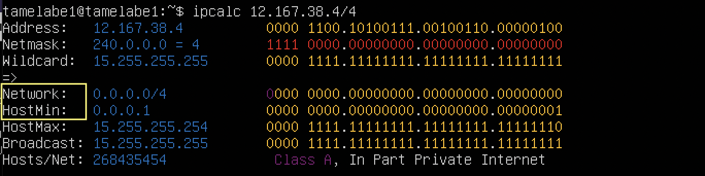
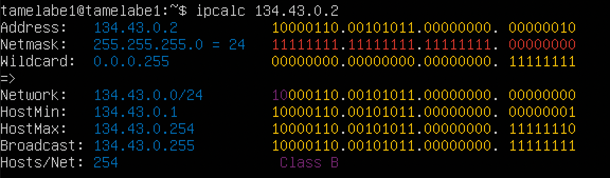
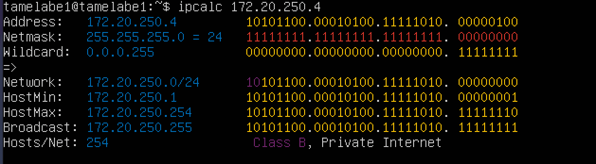
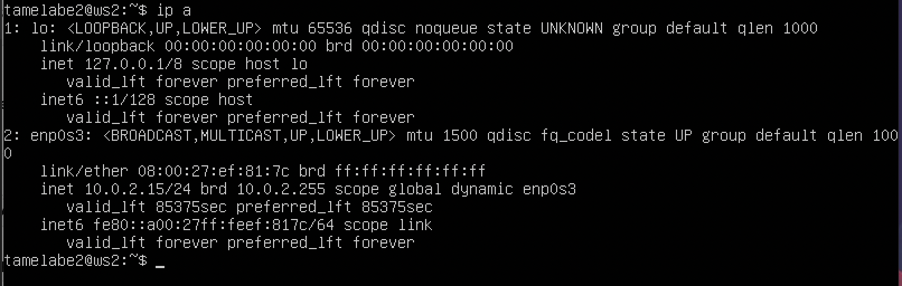
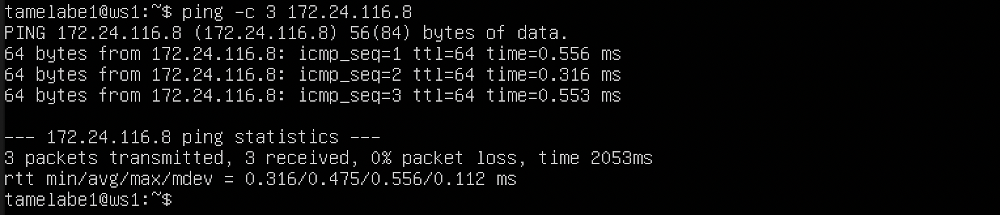
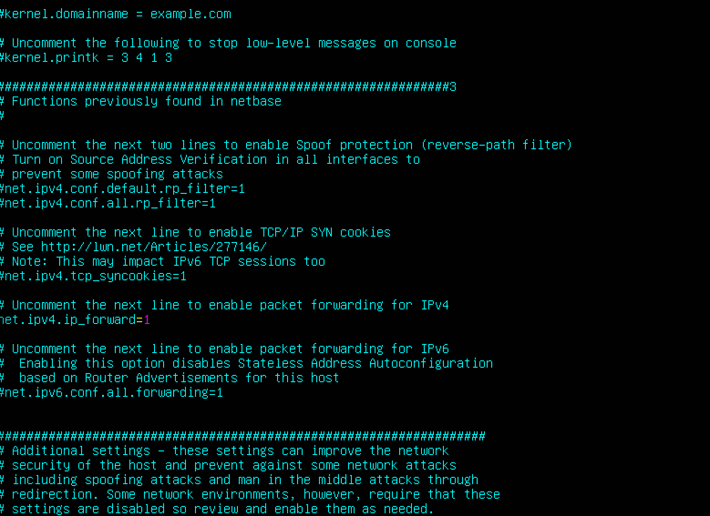

## Part 1. Инструмент ipcalc

- Установил ipcalc

### 1.1. Сети и маски

1. Адрес сети 192.167.38.54/13

2. Перевел маску 255.255.255.0 в префиксную и двоичную запись

- Перевел маску /15 в обычную и двоичную

- Перевел маску 11111111.11111111.11111111.11110000 в обычную и префиксную

3. Минимальный и максимальный хост в сети 12.167.38.4 при масках: /8

- 11111111.11111111.00000000.00000000

- 255.255.254.0

- /4

### 1.2. localhost

* Определил, можно ли обратиться к приложению, работающему на localhost, со следующими IP:

- 194.34.23.100

- 127.0.0.2

- 127.1.0.1

- 128.0.0.1

### 1.3. Диапазоны и сегменты сетей

1. Определил, какие из перечисленных IP можно использовать в качестве публичного, а какие только в качестве частных: 10.0.0.45, 134.43.0.2, 192.168.4.2, 172.20.250.4, 172.0.2.1, 192.172.0.1, 172.68.0.2, 172.16.255.255, 10.10.10.10, 192.169.168.1

- в качестве публичного:

- в качестве частного: 

2. Определил, какие из перечисленных IP адресов шлюза возможны у сети 10.10.0.0/18: 10.0.0.1, 10.10.0.2, 10.10.10.10, 10.10.100.1, 10.10.1.255

У сети 10.10.0.0/18 возможны данные IP адреса шлюза: 10.10.0.2, 10.10.10.10, 10.10.1.255; смотрим диапазон между 'Hostmin' и 'Hostmax'

## Part 2. Статическая маршрутизация между двумя машинами

* С помощью команды ip a посмотрел существующие сетевые интерфейсы

* Описал сетевой интерфейс, соответствующий внутренней сети, на обеих машинах и задал следующие адреса и маски: ws1 - 192.168.100.10, маска /16

ws2 - 172.24.116.8, маска /12

* Выполнил команду netplan apply для перезапуска сервиса сети

### 2.1. Добавил статический маршрут от одной машины до другой и обратно при помощи команды вида ip r add

- Пропинговал соединение между машинами

### 2.2. Добавил статический маршрут от одной машины до другой с помощью файла etc/netplan/00-installer-config.yaml, проверил соединение между машинами, затем перезагрузил машины и еще раз проверил соединение.

- Пропинговал соединение между машинами

## Part 3. Утилита iperf3

- Установил iperf3

### 3.1. Скорость соединения

8 Mbps = 1 MB/s
100 MB/s = 100000 Kbps
1 GB/S = 1000 Mbps

### 3.2. Утилита iperf3

* запускаю на сервере iperf3 -s

* запускаю в клиенте iperf3 -c 192.168.100.10 -p 5201

## Part 4. Сетевой экран

### 4.1. Утилита iptables

* Создал файл /etc/firewall.sh, имитирующий фаерволл, на ws1 и ws2

* содержание файла /etc/firewall.sh для машины ws1

    1) применил стратегию, когда в начале пишется запрещающее правило, а в конце пишется разрешающее правило (это касается пунктов 4 и 5)

    2) открыть на машине доступ для порта 22 (ssh) и порта 80 (http)

    3) запретил echo reply (машина не должна "пинговаться”, т.е. должна быть блокировка на OUTPUT)

    4) разрешил echo reply (машина должна "пинговаться")

* содержание файла /etc/firewall.sh для машины ws2

    1) применил стратегию, когда в начале пишется разрешающее правило, а в конце пишется запрещающее правило (это касается пунктов 4 и 5)

    2) открыл на машине доступ для порта 22 (ssh) и порта 80 (http)

    3) разрешил echo reply (машина должна "пинговаться")

    4) запретил echo reply (машина не должна "пинговаться”, т.е. должна быть блокировка на OUTPUT)

* Запустил файлы на обеих машинах командой sudo chmod +x /etc/firewall.sh && sudo sh /etc/firewall.sh

### 4.2. Утилита nmap

* Пингую ws1

* Пингую ws2 и вызываю команду nmap

## Part 5. Статическая маршрутизация сети

### 5.1. Настройка адресов машин

1. Настроил конфигурации машин в etc/netplan/00-installer-config.yaml согласно сети на рисунке

- ws11

- ws21

- ws22

- r1

- r2

2. Командой ip -4 a проверил, что адрес машины задан верно.

- ws11

- ws21

- ws22

- r1

- r2

3. Также пропинговал ws22 с ws21.

- ws 22

- ws21

4. Аналогично пропинговал r1 с ws11

- r1

- ws11

### 5.2. Включение переадресации IP-адресов.

* Для включения переадресации IP, выполнил команду на роутерах: sysctl -w net.ipv4.ip_forward=1

* Открыл файл /etc/sysctl.conf и добавил в него следующую строку: net.ipv4.ip_forward = 1

### 5.3. Установка маршрута по-умолчанию

1. Настроил маршрут по-умолчанию (шлюз) для рабочих станций. Для этого добавил gateway4 [ip роутера] в файле конфигураций.

- ws11

- ws21

- ws22

2. Вызвал ip r и показал, что добавился маршрут в таблицу маршрутизации.

- ws11

- ws21

- ws22

3. Пропинговать с ws11 роутер r2 и показать на r2, что пинг доходит. Для этого использовать команду: tcpdump

### 5.4. Добавление статических маршрутов

1. Добавил в роутеры r1 и r2 статические маршруты в файле конфигураций.

- r1

- r2

2. Вызвал ip r и показал таблицы с маршрутами на обоих роутерах.

- r1

- r2

3. Запустил команды на ws11: ip r list 10.10.0.0/[маска сети] и ip r list 0.0.0.0/0

* Для адреса 10.10.0.0/[порт сети] был выбран маршрут, отличный от 0.0.0.0/0, потому что маска /18 описывает маршрут к сети точнее, в отличие от маски /0

### 5.5. Построение списка маршрутизаторов

1. Запустил на r1 команду дампа: tcpdump -tnv -i eth0

2. При помощи утилиты traceroute построил список маршрутизаторов на пути от ws11 до ws21

- traceroute основана на протоколе ICMP. Программа traceroute выполняет отправку данных указанному узлу сети, при этом отображая сведения о всех промежуточных маршрутизаторах, через которые прошли данные на пути к целевому узлу.

### 5.6. Использование протокола ICMP при маршрутизации

1. Запустил на r1 перехват сетевого трафика, проходящего через eth0 с помощью команды: tcpdump -n -i eth0 icmp

2. Пропинговал с ws11 несуществующий IP (10.30.0.111) с помощью команды: ping -c 1 10.30.0.111

## Part 6. Динамическая настройка IP с помощью DHCP

1. Для r2 настроил в файле /etc/dhcp/dhcpd.conf конфигурацию службы DHCP: указал адрес маршрутизатора по-умолчанию, DNS-сервер и адрес внутренней сети.

2. В файле /etc/resolv.conf прописал nameserver 8.8.8.8

3. Перезагрузил службу DHCP командой systemctl restart isc-dhcp-server

* Машину ws21 перезагрузил при помощи sudo reboot и через ip a показал, что она получила адрес.

* Также пропинговать ws22 с ws21.

- ws22

- ws21

4. Указал MAC адрес у ws11, для этого в etc/netplan/00-installer-config.yaml надо добавить строки: macaddress: 10:10:10:10:10:BA, dhcp4: true

5. Для r1 настроил аналогично r2, но сделал выдачу адресов с жесткой привязкой к MAC-адресу (ws11). 

* В файле /etc/resolv.conf прописал nameserver 8.8.8.8

* Перезагрузил службу DHCP командой systemctl restart isc-dhcp-server

* Машину ws11 перезагрузил при помощи sudo reboot и через ip a показал, что она получила адрес.

6. Запросил с ws21 обновление ip адреса

 - после обновления

* В данном пункте я пользовался опциями: 
    1) 'dhclient -r'
    2) 'dhclient -v'

## Part 7. NAT

1. В файле /etc/apache2/ports.conf на ws22 и r1 изменил строку Listen 80 на Listen 0.0.0.0:80, то есть сделал сервер Apache2 общедоступным

- ws22

- r1

2. Запустил веб-сервер Apache командой service apache2 start на ws22 и r1

- ws22

- r1

3. Добавил в фаервол, созданный по аналогии с фаерволом из Части 4, на r2 следующие правила:

    1) Удаление правил в таблице filter - iptables -F

    2) Удаление правил в таблице "NAT" - iptables -F -t nat

    3) Отбрасывать все маршрутизируемые пакеты - iptables --policy FORWARD DROP

4. Запустил файл командой sudo chmod +x /etc/firewall.sh && sudo sh /etc/firewall.sh

5. Проверил соединение между ws22 и r1 командой ping (При запуске файла с этими правилами, ws22 не должна "пинговаться" с r1)

- ws22

6. Добавил в файл ещё одно правило: 

    4) Разрешить маршрутизацию всех пакетов протокола ICMP

* Запустил файл командой sudo chmod +x /etc/firewall.sh && sudo sh/etc/firewall.sh

7. Проверил соединение между ws22 и r1 командой ping (При запуске файла с этими правилами, ws22 должна "пинговаться" с r1)

- ws22

8. Добавил в файл ещё два правила: 

    5) Включить SNAT, а именно маскирование всех локальных ip из локальной сети, находящейся за r2 (по обозначениям из Части 5 - сеть 10.20.0.0)

    6) Включить DNAT на 8080 порт машины r2 и добавить к веб-серверу Apache, запущенному на ws22, доступ извне сети

* Запустил файл командой sudo chmod +x /etc/firewall.sh && sudo sh/etc/firewall.sh

9. Проверил соединение по TCP для SNAT, для этого с ws22 подключиться к серверу Apache на r1 командой:
telnet [адрес] [порт]

10. Проверил соединение по TCP для DNAT, для этого с r1 подключиться к серверу Apache на ws22 командой telnet (обращаться по адресу r2 и порту 8080)

## Part 8. Дополнительно. Знакомство с SSH Tunnels

1. Запустил на r2 фаервол с правилами из Части 7 командой sudo chmod +x /etc/firewall.sh && sudo sh/etc/firewall.sh

2. В файле /etc/apache2/ports.conf изменил строку Listen 80 на Listen localhost:80)

3. Запустил веб-сервер Apache на ws22 только на localhost и проверил статус

4. Воспользовался Local TCP forwarding с ws21 до ws22, чтобы получить доступ к веб-серверу на ws22 с ws21

5. Воспользовался Remote TCP forwarding c ws11 до ws22, чтобы получить доступ к веб-серверу на ws22 с ws11

6. Проверил, сработало ли подключение в обоих предыдущих пунктах

